## 🔗 Navigation

**UP:** [[08 - System/Agent Directives/Agent Directives Hub.md|Agent Directives Hub]]

# ONYX Architecture Directive v3.0

> **Audience:** Any developer or AI agent working on or with the ONYX system.
> This document is the single authoritative reference for how ONYX works — from the autonomous kernel loop down to individual pipeline steps and utility functions.
>
> **v3.0 additions:** Profiles & Directives system (§21), Experimenter profile + knowledge compounding (§22), Phase scheduling & control (§23), CLI reference (§24).

---

## Table of Contents

1. [System Philosophy](#1-system-philosophy)
2. [Three-Layer Architecture](#2-three-layer-architecture)
3. [Vault as State Mirror](#3-vault-as-state-mirror)
4. [State Machines (FSM)](#4-state-machines-fsm)
5. [Deterministic Routing Table](#5-deterministic-routing-table)
6. [Entry Points](#6-entry-points)
7. [Pipeline Recipes](#7-pipeline-recipes)
8. [Pipeline Execution Engine](#8-pipeline-execution-engine)
9. [Atomic Step Catalog](#9-atomic-step-catalog)
10. [Self-Healer](#10-self-healer)
11. [Error Taxonomy & Retry Policy](#11-error-taxonomy--retry-policy)
12. [Context Orchestration (QMD)](#12-context-orchestration-qmd)
13. [Vault I/O Layer](#13-vault-io-layer)
14. [Telemetry & Exec Log](#14-telemetry--exec-log)
15. [Notification Chain](#15-notification-chain)
16. [Linear Integration](#16-linear-integration)
17. [Utility Layer](#17-utility-layer)
18. [Constants & Configuration](#18-constants--configuration)
19. [Public API Reference](#19-public-api-reference)
20. [Developer Guide](#20-developer-guide)
21. [Profiles & Directives System ⬅ new](#21-profiles--directives-system)
22. [Knowledge Compounding & Experimenter Loop ⬅ new](#22-knowledge-compounding--experimenter-loop)
23. [Phase Scheduling & Control ⬅ new](#23-phase-scheduling--control)
24. [CLI Reference ⬅ new](#24-cli-reference)

---

## 1. System Philosophy

ONYX is a **deterministic, FSM-driven autonomous agent runtime** for managing software projects.

**Start here for roles/permissions:** [[08 - System/Agent Directives/Agent Roles & Contracts Directive.md|Agent Roles & Contracts Directive]].

Its core principles:

| Principle | Implementation |
|-----------|----------------|
| **Vault as source of truth** | All state lives in Obsidian markdown files. No database. |
| **Deterministic routing** | Given (project_state, atoms, phases) → always the same mode. No LLM routing. |
| **Self-healing** | Detect and repair drift on every run, before touching anything else. |
| **Single writer** | All vault writes go through `writeBundle()`. Never `fs.writeFileSync` directly. |
| **Error taxonomy** | Every failure is RECOVERABLE, BLOCKING, or INTEGRITY — never "unknown". |
| **Atomic steps** | Each pipeline step is independently testable, has a `shouldRun()` guard, and is optionally retriable. |
| **Observability** | Every dispatch logged to ExecLog.md. Every step telemetry'd to JSONL. Every error classified. |

---

## 2. Three-Layer Architecture

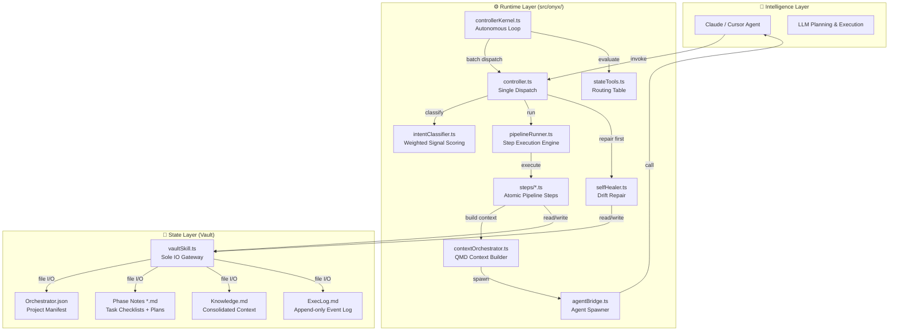

**Rule:** Intelligence layer (Claude/Cursor) only touches vault files via the agent bridge or direct writes inside `<!-- AGENT_WRITABLE_* -->` markers. The runtime layer owns all structural state transitions.

---

## 3. Vault as State Mirror

Every piece of project state lives as a human-readable markdown file. The Orchestrator.json is the message bus — it declares intent, and the runtime makes it real.

### Bundle Structure

```
03 - Ventures/
└── {Namespace}/{ProjectName}/
    ├── Orchestrator.json           ← Project manifest / message bus
    ├── {ProjectName} - Overview.md ← One-paragraph summary + top-level goals
    ├── {ProjectName} - Kanban.md   ← (optional) Kanban view
    ├── {ProjectName} - Knowledge.md← Consolidated context, decisions, Q&A
    ├── Phase 01 - {Name}.md        ← Phase note (plan + tasks + log)
    ├── Phase 02 - {Name}.md
    ├── ExecLog.md                  ← Append-only dispatch log
    └── Docs/                       ← Supporting documentation
```

### Orchestrator.json Schema (ManifestV2)

```jsonc
{
  "project_id": "OpenClaw/Almani",        // Unique project identifier
  "repo_path": "/home/jamal/dev/almani",  // Absolute path to code repo
  "bundle_path": "10 - OpenClaw/Ventures/Almani", // Vault-relative
  "status": "active",                     // ProjectState FSM value
  "active_phase": 2,                      // Which phase is currently executing
  "health": "healthy",                    // 'healthy' | 'degraded' | 'unknown'
  "default_branch": "main",
  "phases": {                             // Phase number → vault-relative path
    "1": "10 - OpenClaw/Ventures/Almani/Phase 01 - Setup.md",
    "2": "10 - OpenClaw/Ventures/Almani/Phase 02 - Core API.md"
  },
  "pipeline_atoms": [                     // Discrete work atoms (from Linear/atomiser)
    { "atom": "import-linear", "status": "complete" },
    { "atom": "plan", "status": "complete" },
    { "atom": "execute", "status": "active" }
  ],
  "linear_project_id": "PROJ-123",        // Linear project ID
  "linear_epic_id": "LIN-456",            // Root Linear epic
  "test_command": "pnpm test",
  "lint_command": "pnpm lint"
}
```

### Phase Note Structure

```markdown
---
status: active
phase_status_tag: active
phase_name: Core API
linear_issue_id: LIN-789
---

# Phase 02 — Core API

## 📂 Tasks
- [x] **High-level goal 1** ← Auto-ticked on phase completion
- [ ] **High-level goal 2**

## 📋 Implementation Plan
<!-- AGENT_WRITABLE_START:phase-plan -->
- [ ] **Task 1:** Set up Express router structure
  - Files: `src/api/router.ts`, `src/api/middleware.ts`
  - Symbols: `createRouter`, `authMiddleware`
  - Steps: Create file → define routes → add middleware
  - Validation: `GET /health` returns 200

- [ ] **Task 2:** Implement auth middleware
  ...
<!-- AGENT_WRITABLE_END:phase-plan -->

## ✅ Acceptance Criteria
- [ ] All endpoints return typed responses
- [ ] Auth middleware covers all routes

## 🚧 Blockers
(none)

## Agent Log
- 2026-03-25T10:00:00Z — Phase transitioned: planned → ready (plan_created)
- 2026-03-25T10:05:00Z — Phase transitioned: ready → active (execution_started)
```

---

## 4. State Machines (FSM)

Three independent FSMs track state at different granularities.

### 4.1 Project State

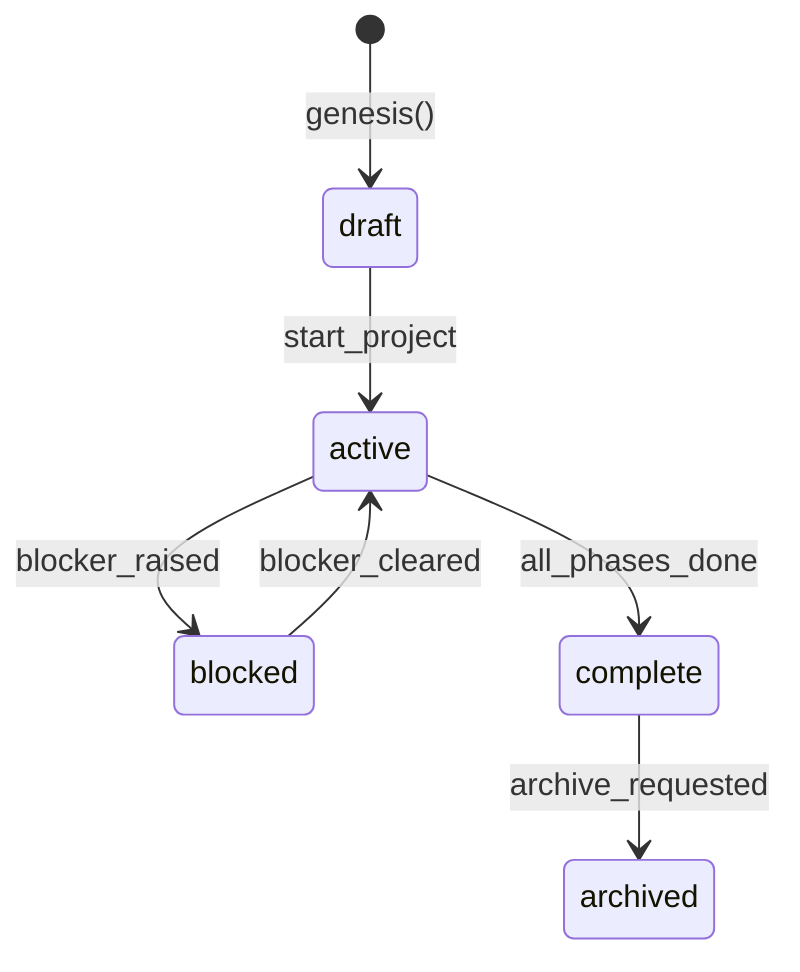

| State | Meaning | Kernel Action |
|-------|---------|---------------|
| `draft` | Created, not yet active | `placement-only` (just record intent) |
| `active` | Work in progress | `full-execute` (run the full pipeline) |
| `blocked` | Manual intervention needed | `status` (surface blocker, don't advance) |
| `complete` | All phases done | `uplink` (sync completion to Linear) |
| `archived` | No further work | `null` (skip entirely) |

### 4.2 Phase State

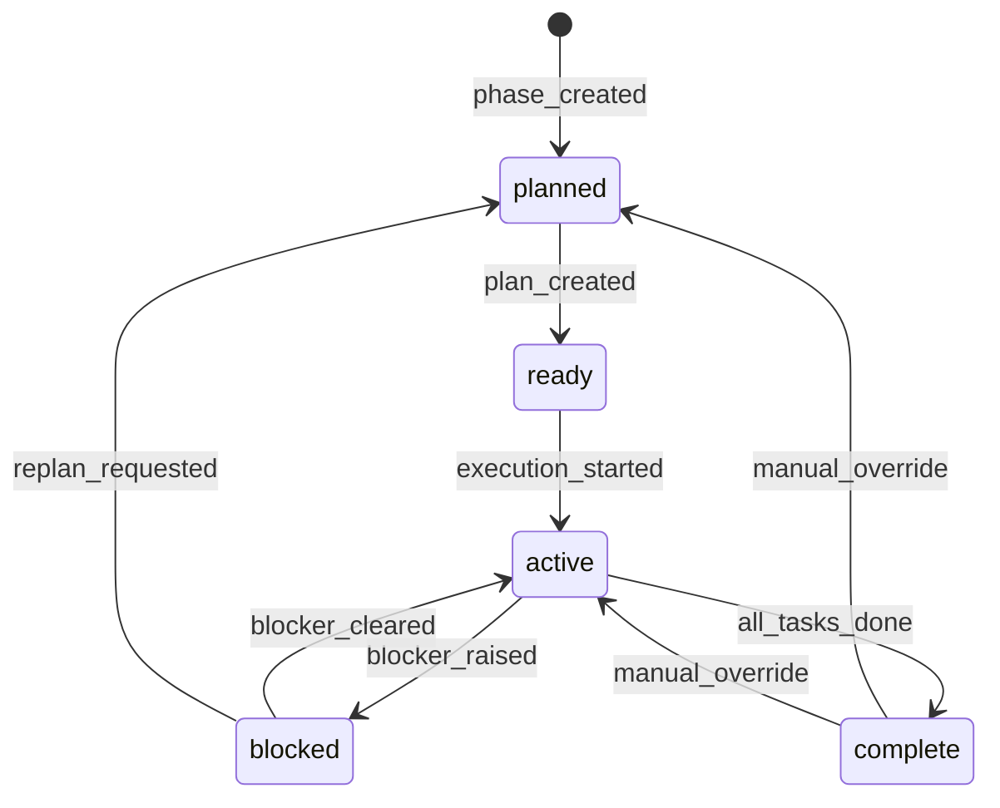

| State | Valid Operations | Self-Healer Can Repair? |
|-------|-----------------|------------------------|
| `planned` | plan | No |
| `ready` | plan, execute | No |
| `active` | execute, block | Yes (→ complete if 0 unchecked tasks) |
| `blocked` | heal, replan | Yes (frontmatter drift) |
| `complete` | consolidate | No |

### 4.3 Task State

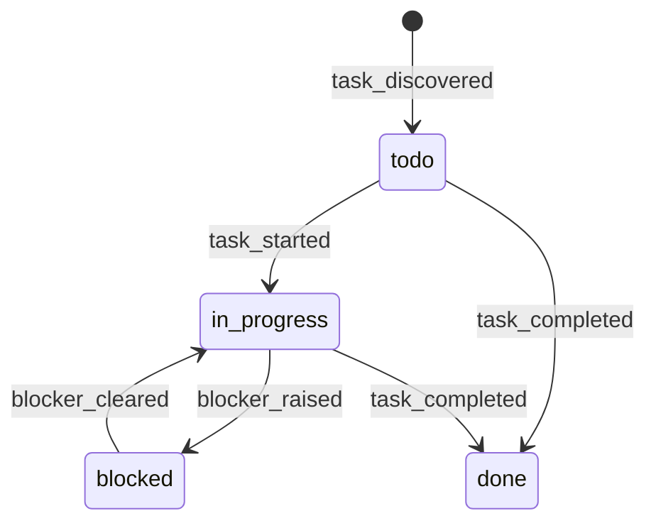

### 4.4 Key FSM Functions

```typescript
// src/onyx/fsm.ts
normalizePhaseState(input: string): PhaseState     // Coerce any raw value to canonical
getPhaseStateFromFrontmatter(fm): PhaseState        // Read phase_status_tag or status
canTransitionPhase(from, to): boolean              // Gate transitions
transitionPhase(from, to, reason): TransitionResult
applyPhaseStateToRaw(content, state): string       // Mutate frontmatter in raw markdown
appendTransitionLog(content, message): string      // Append to ## Agent Log
```

---

## 5. Deterministic Routing Table

The kernel's dispatch decision is **purely deterministic** — given the same `Orchestrator.json`, it always produces the same `(mode, priority)` pair.

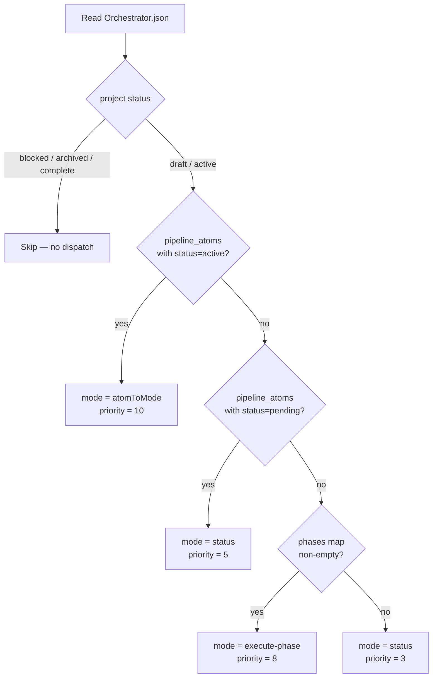

### Routing Table Code

```typescript
// src/onyx/stateTools.ts
export function evaluateRoutingTable(manifest: ManifestSnapshot): DispatchDecision {
  const { status, pipeline_atoms, phases } = manifest;

  if (['blocked', 'archived', 'complete'].includes(status))
    return { dispatch: false, priority: 0, mode: 'status', reason: `project_${status}` };

  const activeAtom = pipeline_atoms?.find(a => a.status === 'active');
  if (activeAtom)
    return { dispatch: true, priority: 10, mode: atomToMode(activeAtom.atom), reason: `atom_active:${activeAtom.atom}` };

  const pendingAtom = pipeline_atoms?.find(a => a.status === 'pending');
  if (pendingAtom)
    return { dispatch: true, priority: 5, mode: 'status', reason: `atom_pending:${pendingAtom.atom}` };

  if (phases && Object.keys(phases).length > 0)
    return { dispatch: true, priority: 8, mode: 'execute-phase', reason: 'phases_available' };

  if (status === 'active')
    return { dispatch: true, priority: 3, mode: 'status', reason: 'active_no_phases' };

  return { dispatch: false, priority: 0, mode: 'status', reason: 'no_work' };
}
```

### PROJECT_STATE_RECIPE Map

```typescript
// Which pipeline recipe each project state drives
export const PROJECT_STATE_RECIPE: Record<ProjectState, PipelineRecipeKey | null> = {
  draft:    'placement-only',  // Just record intent, don't execute
  active:   'full-execute',    // Run the full pipeline
  blocked:  'status',          // Surface blocker to user, don't advance
  complete: 'uplink',          // Sync completion to Linear
  archived: null,              // Skip entirely
};
```

### PHASE_STATE_OPS Map

```typescript
// Which operations are valid for each phase state
export const PHASE_STATE_OPS: Record<PhaseState, readonly string[]> = {
  planned:  ['plan'],               // Can only be planned
  ready:    ['plan', 'execute'],    // Can plan or begin execution
  active:   ['execute', 'block'],   // Can execute tasks or be blocked
  blocked:  ['heal', 'replan'],     // Needs healing or replanning
  complete: ['consolidate'],        // Context consolidation only
};
```

---

## 6. Entry Points

### 6.1 Single Dispatch — `handleMessage()`

The primary API. Called by Claude agents, scripts, and the kernel.

```typescript
// src/onyx/controller.ts
handleMessage(text: string, opts?: {
  projectId?: string;
  mode?: ControllerMode;
  vaultRoot?: string;
  phaseNote?: string;
  linearProjectId?: string;
  runOnboardingWizard?: boolean;
}): Promise<FlowResult>
```

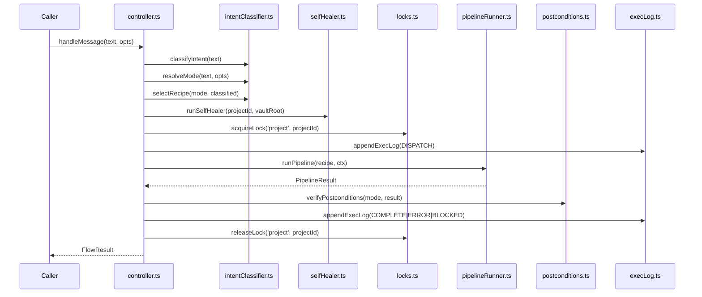

### 6.2 Autonomous Kernel — `runKernel()`

The batch orchestrator. Runs on a schedule or via CLI.

```typescript
// src/onyx/controllerKernel.ts
runKernel(opts?: {
  vaultRoot?: string;
  dryRun?: boolean;
  maxIterations?: number;     // default: 20
  projectFilter?: string;     // single project ID to target
}): Promise<KernelResult>
```

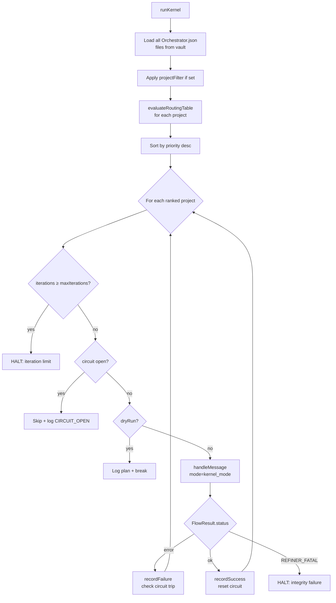

**Circuit Breaker:** After `CIRCUIT_MAX_FAILURES` (3) consecutive failures for a project, that project is skipped for `CIRCUIT_COOLDOWN_MS` (30 min). Only INTEGRITY errors halt the entire kernel — all other failures skip the project and continue.

### 6.3 ControllerMode Values

```typescript
type ControllerMode =
  | 'auto'           // Classifier decides
  | 'execute-phase'  // Run next unchecked task via agent
  | 'plan-phase'     // Generate implementation plan for a phase
  | 'replan-phase'   // Force-regenerate implementation plan
  | 'status'         // Report current project state
  | 'import-linear'  // Pull Linear issues into vault as phases
  | 'uplink'         // Push vault state back to Linear
  | 'sync-linear'    // Sync Linear ↔ vault phase status
```

---

## 7. Pipeline Recipes

A recipe is an **ordered list of steps with conditional execution guards**. Each step has a `shouldRun()` that evaluates `ctx` to decide if it applies.

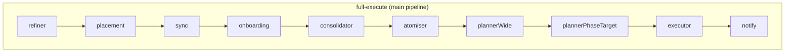

### All 7 Recipes

| Recipe | Steps | When Used |
|--------|-------|-----------|
| `full-execute` | refiner → placement → sync → onboarding → consolidator → atomiser → plannerWide → plannerPhaseTarget → executor → notify | `active` project, normal execution |
| `plan-phase` | placement → plannerPlanPhase → notify | Explicit plan request or replan |
| `status` | statusStep → notify | Blocked project or status check |
| `import-linear` | linearImport → placement → atomiser → sync → plannerWide → linearUplink → notify | Import Linear issues into vault |
| `uplink` | linearUplink → notify | Push vault state to Linear |
| `sync-linear` | linearSync → notify | Sync Linear ↔ vault phase mapping |
| `placement-only` | placement → placementOnlyHint → notify | Draft project (just record intent) |

### Recipe Selection Logic

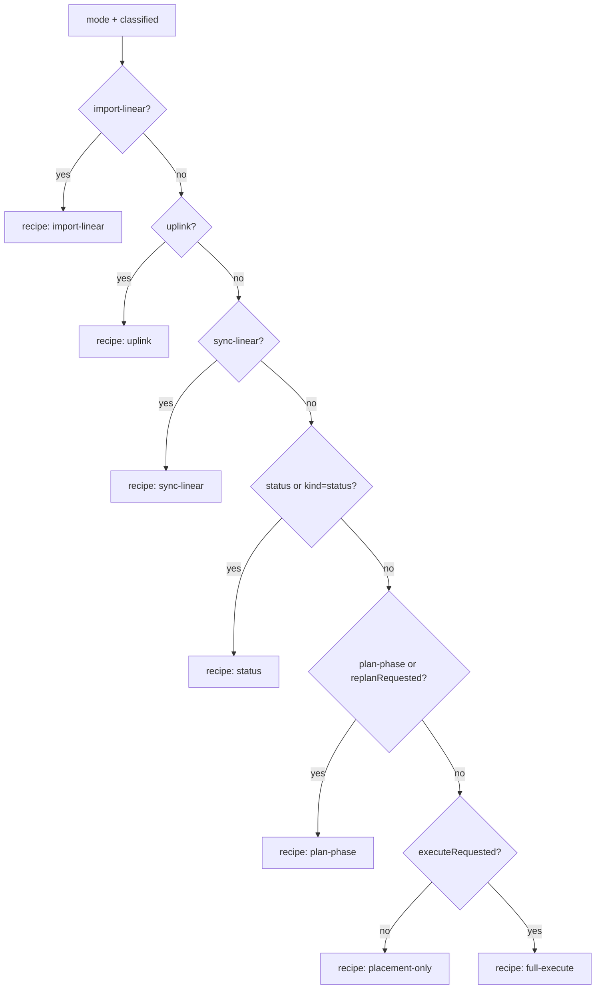

---

## 8. Pipeline Execution Engine

```typescript
// src/onyx/pipelineRunner.ts
runPipeline(recipe: PipelineStep[], ctx: PipelineContext): Promise<PipelineResult>
```

### PipelineContext

The shared mutable context passed to every step:

```typescript
interface PipelineContext {
  // Identity
  runId: string;           // UUID for this run
  projectId: string;
  vaultRoot: string;
  text: string;            // Original user message
  mode: string;            // Resolved controller mode
  phaseNumber?: number;
  phaseRel?: string;       // Vault-relative path to target phase
  dryRun?: boolean;

  // Accumulate across steps
  actions: string[];       // Machine-readable action log
  messages: string[];      // Human-readable messages for Jamal
  blockers: string[];      // Blocker descriptions
  changes: string[];       // Files changed
  phasesExecuted: { projectId: string; phaseNumber: number }[];
  projectsTouched: string[];

  // Inter-step state bag
  state: Record<string, unknown>;

  // Abort control
  abort: boolean;
  abortStatus?: 'error' | 'blocked';
  abortCode?: string;
  abortMessage?: string;
}
```

### PipelineStep Interface

```typescript
interface PipelineStep {
  name: string;
  shouldRun: (ctx: PipelineContext) => boolean;   // Guard: skip if false
  execute: (ctx: PipelineContext) => Promise<StepResult>;
  retryPolicy?: RetryPolicy;    // RECOVERABLE_POLICY | AGENT_POLICY | NO_RETRY
  critical?: boolean;           // true = abort pipeline on failure
}
```

### Step Execution Flow

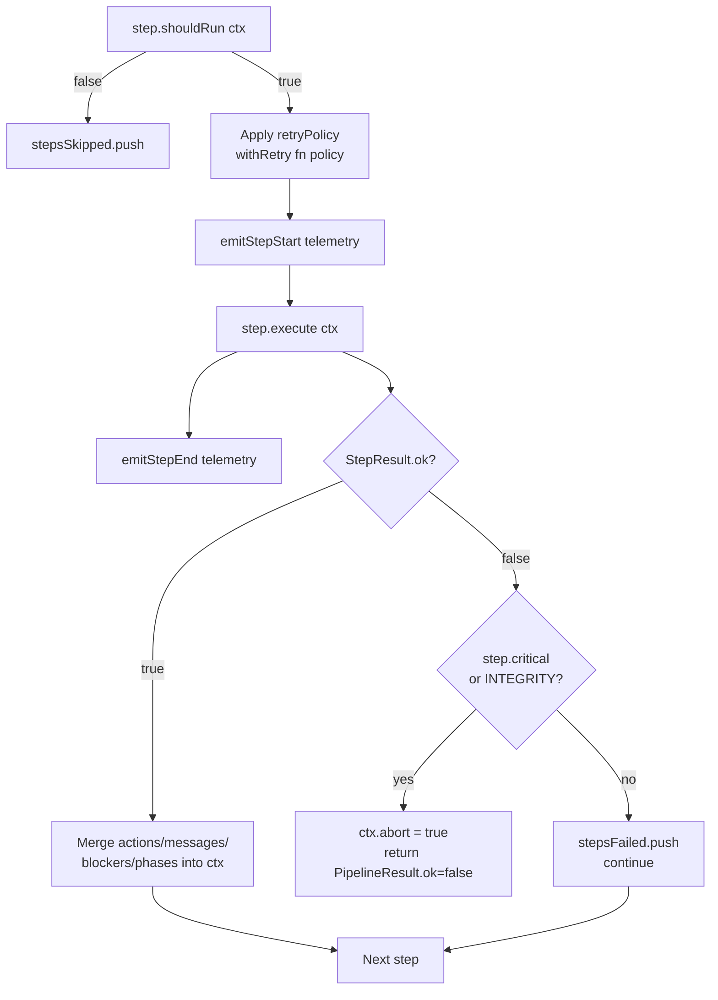

### StepResult

```typescript
interface StepResult {
  ok: boolean;
  actions?: string[];
  messages?: string[];
  blockers?: string[];
  changes?: string[];
  phasesExecuted?: { projectId: string; phaseNumber: number }[];
  projectsTouched?: string[];
  retryable?: boolean;
  error_code?: string;
  error_message?: string;
  haltPipeline?: boolean;   // Stop pipeline even when ok=true
}
```

---

## 9. Atomic Step Catalog

### 9.1 `refinerStep` — Schema Validator

**Purpose:** Validate and repair `Orchestrator.json` before any execution. Catch structural drift early.

**shouldRun:** Always (first step in `full-execute`)

**Does:**
- Parse and Zod-validate the manifest against `ProjectManifestSchema`
- Repair known drift patterns (missing fields, stale enums)
- Write back corrected manifest via `writeBundle()`

**On failure:** Sets `error_code: REFINER_FATAL` → kernel halts entirely (INTEGRITY class)

---

### 9.2 `placementStep` — Bundle Existence + Active Phase

**Purpose:** Ensure the vault bundle exists and `active_phase` points to a real phase note.

**shouldRun:** Always

**Does:**
- Resolve bundle path from `Orchestrator.json`
- If bundle missing: create skeleton via `genesis()`
- Find the active phase, verify it exists on disk
- Set `ctx.state['phaseRel']` for downstream steps
- Update `active_phase` in manifest if needed

---

### 9.3 `syncStep` — Checkbox → Phase State Sync

**Purpose:** Sync phase FSM state from checkbox task completion state.

**shouldRun:** Always in `full-execute`

**Does:**
- For each phase: count unchecked tasks
- If 0 unchecked and state=active: transition → complete
- If unchecked tasks and state=complete: transition → active (re-open)
- Writes FSM changes via `applyPhaseStateToRaw()` + `writeBundle()`

---

### 9.4 `onboardingWizardStep` — Wizard Gate

**Purpose:** Gate `full-execute` to only run the onboarding wizard when explicitly requested.

**shouldRun:** Only when `ctx.state['runOnboardingWizard']` is set and `projectId === ONBOARDING_WIZARD_PROJECT_ID`

**Does:**
- Run the onboarding wizard agent flow
- Generate the onboarding report
- Set `ctx.state['wizardCliReport']` and `ctx.state['wizardReportPath']`

---

### 9.5 `consolidatorStep` — Archive Completed Phases

**Purpose:** When a phase reaches `complete`, consolidate its learnings into `Knowledge.md`.

**shouldRun:** Any phase just transitioned to complete

**Does:**
- Extract tasks, acceptance criteria, and agent log entries from the completed phase
- Append structured summary block to `Knowledge.md`
- Mark phase as consolidated in frontmatter
- Writes via `writeBundle()`

---

### 9.6 `atomiserStep` — Generate Phase Skeletons

**Purpose:** Turn a flat Linear import or high-level task list into structured phase note files.

**shouldRun:** `pipeline_atoms` contains an `atomise` atom with `status=active`, or post-import

**Does:**
- For each linear issue / task group: create a Phase `N` markdown file
- Populate frontmatter (status=planned, phase_name, linear_issue_id)
- Add `## 📂 Tasks` with high-level checkbox items
- Add empty `## 📋 Implementation Plan` with agent-writable markers
- Update `Orchestrator.json` phases map
- Writes via `writeBundle()`

---

### 9.7 `plannerWideStep` — Plan All Incomplete Phases

**Purpose:** Ensure every `planned` or `ready` phase has an Implementation Plan.

**shouldRun:** Phase without an Implementation Plan exists

**Does:**
- For each phase in `planned` or `ready` state with no Implementation Plan:
  - Transition phase to `ready`
  - Call `planPhase(bundle, phaseNode, repoPath, vaultRoot)`
  - Planner agent generates 8–10 granular tasks
  - Inject between `<!-- AGENT_WRITABLE_* -->` markers
  - Transition phase to `ready`

---

### 9.8 `plannerPhaseTargetStep` — Targeted Phase Replan

**Purpose:** Force-replan the specific phase pointed to by `active_phase`.

**shouldRun:** `ctx.state['forceReplan']` is true, or active phase has no tasks

**Does:**
- Load the active phase note
- Check if Implementation Plan is empty or stale
- Call `planPhase()` with the targeted phase
- Always re-generates if `forceReplan=true`

---

### 9.9 `executorStep` — Task Execution Loop

**Purpose:** Find the next unchecked task and execute it via an agent.

**shouldRun:** Active phase has at least one unchecked task

**Does:**
1. Call `findNextTask(phaseContent)` from `utils/phaseParser.ts`
2. If no task: phase is done → transition to complete
3. Build QMD context via `buildQMDContext()` from `contextOrchestrator.ts`
4. Build compact directive string
5. Resolve focused workdir from task's `Files:` metadata
6. Dispatch to Cursor agent via `executeAgentThroughBridge()`
7. If successful: call `tickTask()` to mark `- [ ] → - [x]`
8. Write updated phase content via `writeBundle()`
9. Append to `## Agent Log`
10. Check if all tasks now done → complete phase

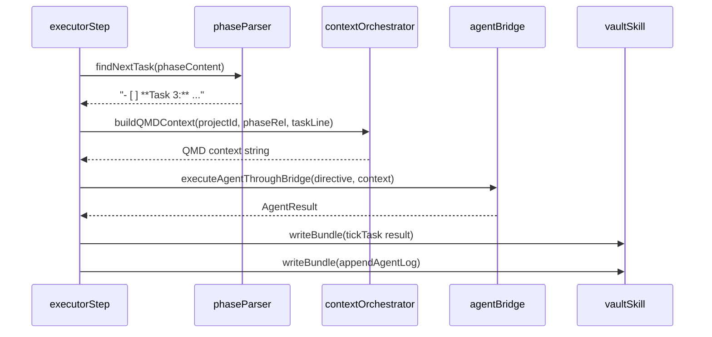

---

### 9.10 `statusStep` — Project Status Report

**Purpose:** Generate a human-readable status summary without changing any state.

**shouldRun:** Recipe is `status`

**Does:**
- Read current manifest and all phase notes
- Count tasks (total / done / remaining)
- Check for blockers
- Format status message for Jamal
- No writes

---

### 9.11 `linearImportStep` — Import from Linear

**Purpose:** Pull Linear project issues into vault as structured phase entries.

**shouldRun:** Recipe is `import-linear`

**Does:**
- Authenticate with Linear API
- Fetch project issues by `linearProjectId`
- Map issues → phase structure
- Create/update phases in manifest
- Write phase note skeletons

---

### 9.12 `linearUplinkStep` — Push to Linear

**Purpose:** Create or update Linear issues to mirror vault phase state.

**shouldRun:** Recipe is `uplink` or post-import

**Does:**
- For each phase: `findOrCreateIssue()` (idempotent by title dedup)
- For each task: create child issue under phase issue
- Persist `linear_issue_id` in phase frontmatter
- Write via `withPhaseLinearIssueId()` + `writeBundle()`

---

### 9.13 `notifyStep` — Dispatch Notification

**Purpose:** Send a summary notification after every pipeline run.

**shouldRun:** Always (last step in every recipe)

**Does:**
- Build `NotifyPayload` from accumulated `ctx.actions` + `ctx.phasesExecuted`
- Dispatch via `dispatchNotification()` (stdout → file → WhatsApp)

---

## 10. Self-Healer

Runs as the **very first action** in every `handleMessage()` call, before locking or pipeline execution.

```typescript
runSelfHealer(projectId: string, vaultRoot: string): HealResult
```

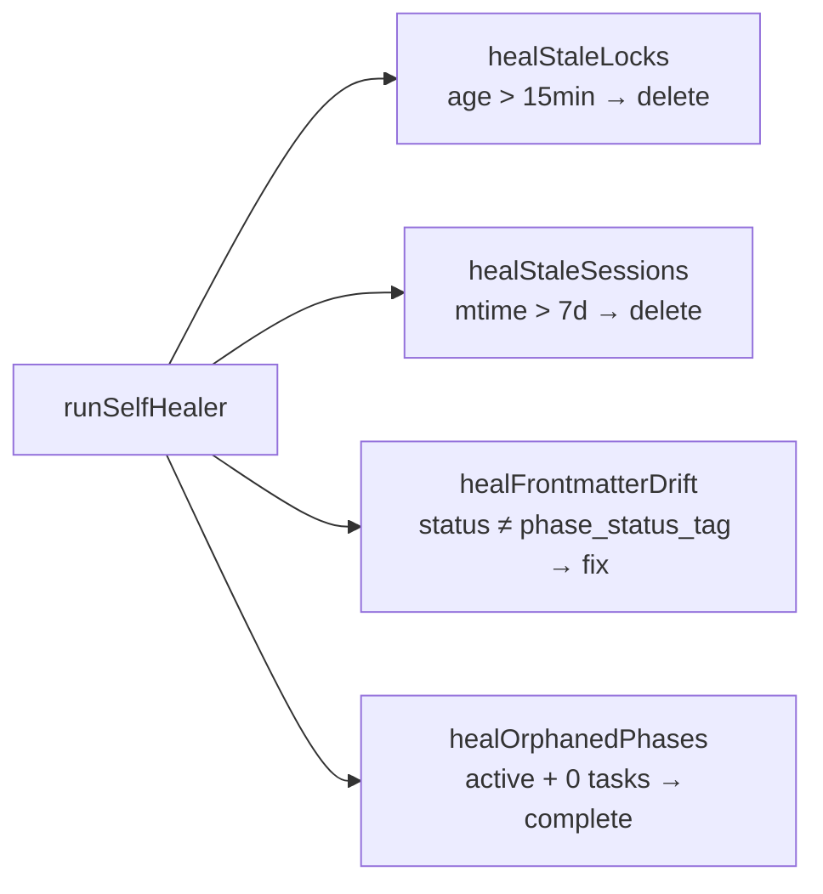

### Repair Types

| Type | Detection | Repair |
|------|-----------|--------|
| `stale_lock` | Lock file age > `LOCK_STALE_MS` (15 min) | Delete lock file |
| `corrupt_lock` | Lock file unparseable JSON | Delete lock file |
| `stale_session` | Session mtime > `SESSION_STALE_MS` (7 days) | Delete session file |
| `frontmatter_drift` | `status` ≠ `phase_status_tag` in frontmatter | Apply canonical state via `applyPhaseStateToRaw()` |
| `orphaned_phase` | Phase state = `active` AND zero unchecked tasks | Transition phase → `complete` |

**All vault repairs go through `writeBundle()` — never direct `fs.writeFileSync`.**

---

## 11. Error Taxonomy & Retry Policy

### Three Failure Classes

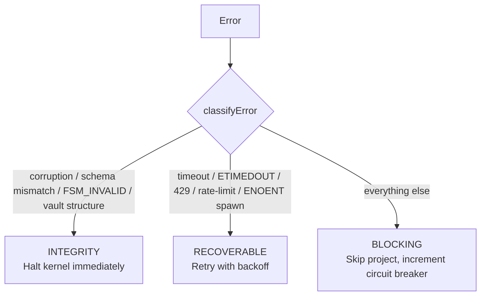

```typescript
// src/onyx/errors.ts
enum FailureClass {
  RECOVERABLE = 'RECOVERABLE',  // Transient: will self-resolve
  BLOCKING    = 'BLOCKING',     // Needs human triage
  INTEGRITY   = 'INTEGRITY',    // Structural corruption — halt now
}
```

### Error Classes

```typescript
class GZError extends Error {
  failureClass: FailureClass;
  component: string;
  retryable: boolean;
}
class RecoverableError extends GZError { } // failureClass = RECOVERABLE
class BlockingError    extends GZError { } // failureClass = BLOCKING
class IntegrityError   extends GZError { } // failureClass = INTEGRITY
```

### Retry Policies

| Policy | Max Attempts | Backoff | Retries On |
|--------|-------------|---------|------------|
| `RECOVERABLE_POLICY` | 3 | `1000 × 2^n + rand(0-500ms)` | RECOVERABLE only |
| `AGENT_POLICY` | 2 | `2000 × 2^n + rand(0-1000ms)` | RECOVERABLE only |
| `NO_RETRY` | 1 | none | never |

```typescript
withRetry<T>(fn: () => Promise<T>, policy: RetryPolicy, onRetry?: (attempt, err) => void): RetryResult<T>
```

### FlowResult Error Codes

| Code | Class | Meaning |
|------|-------|---------|
| `REFINER_FATAL` | INTEGRITY | Orchestrator.json corrupted — kernel halts |
| `FSM_INVALID_TRANSITION` | INTEGRITY | Illegal phase state transition |
| `PIPELINE_CRASH` | BLOCKING | Unhandled exception in pipeline |
| `CHECKS_FAILED` | BLOCKING | Postcondition violations after execute |
| `LINEAR_IMPORT_FAILED` | RECOVERABLE | Linear API error during import |
| `LINEAR_UPLINK_FAILED` | RECOVERABLE | Linear API error during uplink |
| `LINEAR_SYNC_FAILED` | RECOVERABLE | Linear sync API error |

---

## 12. Context Orchestration (QMD)

Every agent invocation receives a structured context string (QMD format) that scopes exactly what the agent needs.

```typescript
// src/onyx/contextOrchestrator.ts
buildQMDContext(
  projectId: string,
  phaseRel: string,
  taskLine?: string,
  intent?: string,
  vaultRoot?: string
): string
```

### QMD Block Types

```yaml
```query
phase:
  file: 10 - OpenClaw/Ventures/Almani/Phase 02 - Core API.md
  excerpt: |
    ## 📋 Implementation Plan (scoped)
    - [ ] **Task 3:** Implement auth middleware
      - Files: src/api/middleware.ts
      - Symbols: authMiddleware, JWTPayload
```

```query
knowledge:
  file: 10 - OpenClaw/Ventures/Almani/Knowledge.md
  excerpts: |
    JWT tokens use HS256. Secret in ONYX_JWT_SECRET env.
    Auth middleware must attach decoded payload to req.user.
```

```query
exec_log:
  recent_entries: |
    2026-03-25T10:05:00Z | COMPLETE | executor | task=Task 2 done

```query
files:
  task_files:
    - path: src/api/router.ts
      symbols: createRouter
      excerpt: |
        export function createRouter() {
          const router = Router();
```
```

### Context Assembly Priority

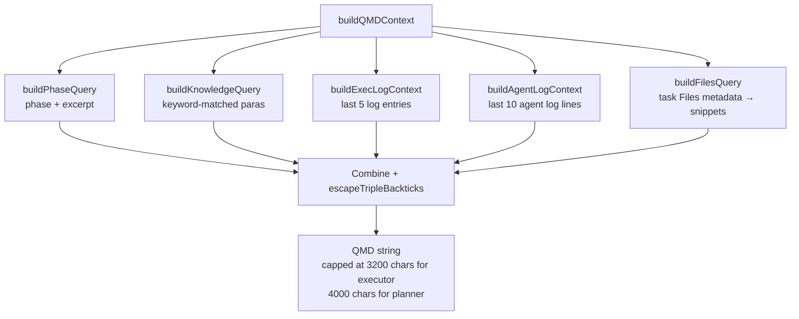

**Task scoping:** When `taskLine` is provided, the Implementation Plan excerpt is scoped to only the matching task block (not the full plan), keeping context tight.

---

## 13. Vault I/O Layer

**Rule:** All reads and writes to the vault MUST go through `vaultSkill.ts`. No step or healer may call `fs.readFileSync` / `fs.writeFileSync` on vault files directly.

```typescript
// src/onyx/vaultSkill.ts — sole IO gateway

// Read entire bundle (all files as BundleNode objects)
readBundle(projectId: string, vaultRoot: string): VaultBundle

// Write any bundle node atomically
writeBundle(opts: {
  projectId: string;
  node: 'phase' | 'overview' | 'knowledge' | 'config' | 'execlog';
  phaseFile?: string;       // Required when node='phase'
  frontmatter?: Record<string, unknown>;
  content: string;
}, vaultRoot: string): void

// Read Orchestrator.json config
readOrchestratorConfig(projectId: string, vaultRoot: string): ProjectOrchestratorConfig

// Resolve bundle directory path
resolveBundlePath(projectId: string, vaultRoot: string): string
```

### BundleNode

Every file in the vault is loaded as a `BundleNode`:

```typescript
interface BundleNode {
  path: string;                          // Absolute path
  exists: boolean;                       // false if file missing
  frontmatter: Record<string, unknown>;  // Parsed YAML frontmatter
  content: string;                       // Body after frontmatter strip
  raw: string;                           // Full file including frontmatter
}
```

### VaultBundle

```typescript
interface VaultBundle {
  projectId: string;
  bundleDir: string;
  overview: BundleNode;
  kanban: BundleNode;
  knowledge: BundleNode;
  docsHub?: BundleNode;
  phases: BundleNode[];    // Sorted by filename (Phase 01, Phase 02, ...)
  docs: BundleNode[];
}
```

---

## 14. Telemetry & Exec Log

### Exec Log (`ExecLog.md`)

Every dispatch is appended to the project's `ExecLog.md` as a markdown H3 block. Human-readable and parseable.

```markdown
### 2026-03-25T10:05:00.000Z | COMPLETE | controller
run_id: abc123 | mode: execute-phase | status: complete | actions: 7 | phases_executed: P2
```

**Log Levels:** `DISPATCH | COMPLETE | ERROR | BLOCKED | SYNC | GENESIS | DRY-RUN | FATAL | INFO`

```typescript
appendExecLog(projectId: string, entry: ExecLogEntry, vaultRoot?: string): void
appendRunLog(projectId: string, runId: string, content: string, vaultRoot?: string): void
queryExecLog(projectId: string, level?: LogLevel, vaultRoot?: string): string[]
```

### Telemetry (JSONL)

Machine-readable structured events written to `.onyx-telemetry/YYYY-MM-DD.jsonl`:

```json
{"type":"step_start","timestamp":"2026-03-25T10:05:00.000Z","run_id":"abc123","project_id":"OpenClaw/Almani","component":"executorStep","phase_number":2}
{"type":"step_end","timestamp":"2026-03-25T10:05:04.123Z","run_id":"abc123","project_id":"OpenClaw/Almani","component":"executorStep","duration_ms":4123,"metadata":{"task":"Task 3 done"}}
```

**Event Types:** `step_start | step_end | step_error | step_retry | pipeline_start | pipeline_end | self_heal | circuit_break | dispatch`

```typescript
emitStepStart(runId, projectId, component, phaseNumber?): () => void  // returns end fn
emitStepError(runId, projectId, component, error, metadata?)
emitSelfHeal(runId, projectId, description)
emitCircuitBreak(projectId, failures, cooldownUntil)
readTelemetryLog(date?: string): TelemetryEvent[]
```

---

## 15. Notification Chain

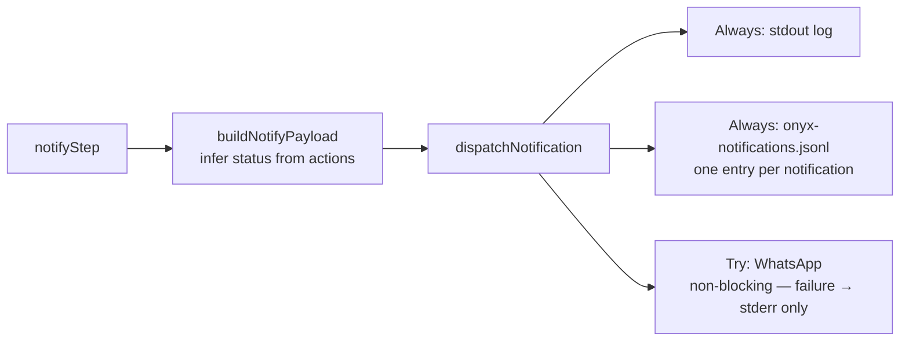

### NotifyPayload

```typescript
interface NotifyPayload {
  projectId: string;
  phaseLabel: string;
  status: 'complete' | 'blocked' | 'info';
  summary: string;
  blockers?: string;
  completedTasks?: string;
  runId?: string;
  wizardReportPath?: string;
}
```

**Status inference:** If `phasesExecuted.length > 0` → `complete`. If `blockers.length > 0` → `blocked`. Otherwise → `info`.

**Invariant (2026-03-26):** WhatsApp delivery failures are written to `stderr` only — never to `onyx-notifications.jsonl`. This prevents duplicate entries in the dashboard Activity feed. Previous behaviour (writing a second JSONL entry on failure) has been removed.

---

## 16. Linear Integration

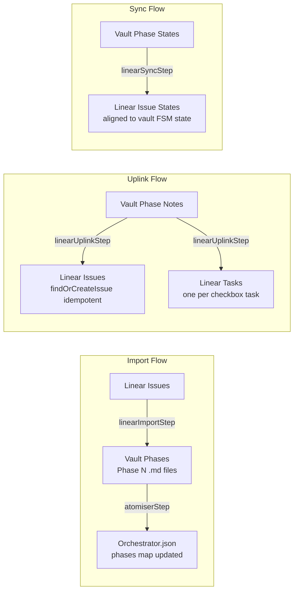

### Idempotency

All Linear operations use `normalizeIssueTitleForDedupe()` to dedup by title before creating issues. Running `uplink` twice produces no duplicates.

### Phase ↔ Linear Issue Mapping

- Phase note frontmatter: `linear_issue_id: LIN-789`
- Persisted via `withPhaseLinearIssueId()` + `writeBundle()`
- All checkbox tasks under a phase become child issues of the phase issue

---

## 17. Utility Layer

### `utils/phaseParser.ts` — Canonical Task Discovery

The single implementation replacing three previous duplicates. All consumers import from here.

```typescript
findNextTask(phaseContent: string): string | null
parseCheckboxTasks(content: string): CheckboxTask[]
acceptanceCriteriaSatisfied(content: string): boolean
isCheckboxLine(trimmed: string): boolean
isUncheckedTask(trimmed: string): boolean
isSectionHeading(line: string, titleFragment: string): boolean
toggleCodeFence(line: string, inCode: boolean): boolean
```

**Task discovery priority (all functions):**
1. `## 📋 Implementation Plan` → `### Implementation Tasks`
2. `## 📂 Tasks` (only when no Implementation Plan exists)
3. Fallback: any `- [ ]` outside excluded headings (Acceptance Criteria, Blockers, Agent Log)

### `utils/sectionUtils.ts` — Section Manipulation

```typescript
findSectionRange(content, heading): { start: number; end: number } | null
appendBulletToSection(content, heading, bullet): string
ensureSection(content, heading): string
replaceSection(content, heading, newBody): string
upsertProseSection(content, heading, newBody): string
```

### `utils/workdirUtils.ts` — Working Directory Resolution

```typescript
// Resolve focused workdir from task Files: metadata
resolveFocusedWorkdir(taskLine: string, repoPath: string): string

// Find deepest common ancestor of a list of absolute paths
commonAncestorDir(absPaths: string[]): string
```

**Heuristic:** Extract paths from `Files:` line in task metadata → resolve relative to repo → find common ancestor → return as focused workdir for agent.

---

## 18. Constants & Configuration

```typescript
// src/onyx/constants.ts

// Timeouts
LOCK_STALE_MS          = 15 * 60 * 1000      // 15 min — stale lock cleanup
REFINER_LOCK_STALE_MS  = 20 * 60 * 1000      // 20 min — refiner-specific lock
SESSION_STALE_MS       = 7 * 24 * 60 * 60 * 1000  // 7 days — cursor session
CIRCUIT_COOLDOWN_MS    = 30 * 60 * 1000      // 30 min — circuit breaker cooldown
CIRCUIT_MAX_FAILURES   = 3                    // trips circuit
MAX_KERNEL_ITERATIONS  = 20                   // per runKernel() call

// Section headings (used everywhere — single source of truth)
SECTION = {
  IMPLEMENTATION_PLAN: '📋 Implementation Plan',
  IMPL_TASKS_SUB:      'Implementation Tasks',
  TASKS:               '📂 Tasks',
  ACCEPTANCE_CRITERIA: '✅ Acceptance Criteria',
  BLOCKERS:            '🚧 Blockers',
  AGENT_LOG:           'Agent Log',
  OUTCOMES:            'Phase Outcomes (Definition of Done)',
}

// Agent-writable boundary markers
AGENT_WRITABLE = {
  START: '<!-- AGENT_WRITABLE_START:phase-plan -->',
  END:   '<!-- AGENT_WRITABLE_END:phase-plan -->',
}

// Headings excluded from task discovery
EXCLUDED_TASK_HEADINGS = [
  SECTION.ACCEPTANCE_CRITERIA,
  SECTION.BLOCKERS,
  SECTION.AGENT_LOG,
]
```

### Environment Variables

| Variable | Default | Purpose |
|----------|---------|---------|
| `ONYX_VAULT_ROOT` | `/home/jamal/Obsidian/OnyxVault` | Vault root path |
| `ONYX_EXEC_MODELS` | `composer-2,gpt-4.1-mini,sonnet-4` | Executor model list (comma-sep, tried in order) |
| `ONYX_PLAN_MODELS` | `composer-2,gpt-4.1-mini` | Planner model list |
| `ONYX_WHATSAPP_RECIPIENT` | — | Phone number for WhatsApp notifications (e.g. `+447700000000`). If unset, WhatsApp delivery is silently skipped. |
| `DEBUG_ONYX` | `0` | Set to `1` for verbose stderr output |
| `ONYX_JWT_SECRET` | — | JWT secret for auth middleware context |
| `LINEAR_API_KEY` | — | Linear GraphQL API key |

---

## 19. Public API Reference

```typescript
// src/onyx/index.ts — grouped by concern

// ── Entry Points ──────────────────────────────────────────────────────────
export { handleMessage }       from './controller.js'       // single-project dispatch
export { runKernel }           from './controllerKernel.js' // multi-project autonomous loop

// ── Intent Classification ─────────────────────────────────────────────────
export { classifyIntent, resolveMode, loadKnownProjectIds } from './intentClassifier.js'
export type { ClassifiedIntent }                            from './intentClassifier.js'

// ── Pipeline ──────────────────────────────────────────────────────────────
export { runPipeline, createPipelineContext } from './pipelineRunner.js'
export { MODE_RECIPES }                       from './pipelines.js'
export type { PipelineStep, PipelineContext, StepResult, PipelineResult } from './pipelineRunner.js'
export type { PipelineRecipeKey }             from './pipelines.js'

// ── FSM ───────────────────────────────────────────────────────────────────
export { normalizePhaseState, getPhaseStateFromFrontmatter,
         canTransitionPhase, transitionPhase,
         applyPhaseStateToRaw, appendTransitionLog }   from './fsm.js'
export { PROJECT_STATE_RECIPE, PHASE_STATE_OPS,
         evaluateRoutingTable }                         from './stateTools.js'
export type { ProjectState, PhaseState, TaskState }    from './fsm.js'

// ── Phase Operations ──────────────────────────────────────────────────────
export { ensurePhaseActive, ensurePhaseReady,
         transitionPhaseNode }                          from './phaseLifecycle.js'
export { findNextTask, tickTask, appendBlocker,
         appendAgentLog, completePhase }                from './phaseExecutor.js'
export { planPhase }                                    from './phasePlanner.js'
export { replanPhase }                                  from './replan.js'

// ── Vault I/O ─────────────────────────────────────────────────────────────
export { readBundle, writeBundle, readOrchestratorConfig,
         resolveBundlePath, parseFrontmatter }          from './vaultSkill.js'
export type { VaultBundle, BundleNode,
              ProjectOrchestratorConfig }               from './vaultSkill.js'

// ── Context ───────────────────────────────────────────────────────────────
export { buildQMDContext, buildPhaseQuery,
         buildKnowledgeQuery, buildFileSnippetQuery }   from './contextOrchestrator.js'
export { executeAgentThroughBridge }                    from './agentBridge.js'

// ── Self-Healing ──────────────────────────────────────────────────────────
export { runSelfHealer }          from './selfHealer.js'
export type { HealResult, HealAction } from './selfHealer.js'

// ── Errors & Retry ────────────────────────────────────────────────────────
export { FailureClass, classifyError, isRetryable, wrapError,
         GZError, RecoverableError, BlockingError, IntegrityError } from './errors.js'
export { withRetry, RECOVERABLE_POLICY, AGENT_POLICY, NO_RETRY }    from './retryPolicy.js'

// ── Telemetry ─────────────────────────────────────────────────────────────
export { emit, emitStepStart, emitStepError,
         emitSelfHeal, emitCircuitBreak,
         readTelemetryLog }        from './telemetry.js'
export { appendExecLog, appendRunLog, queryExecLog } from './execLog.js'

// ── Notifications ─────────────────────────────────────────────────────────
export { buildNotifyPayload, inferNotifyStatus,
         formatNotifyMessage }     from './notify.js'
export { dispatchNotification }    from './notifyAgent.js'

// ── Types ─────────────────────────────────────────────────────────────────
export type { FlowResult, ControllerMode } from './controllerTypes.js'
export type { RunContext, FlowName }       from './runContext.js'
```

---

## 20. Developer Guide

### Running the System

```bash
# Dry-run the kernel (shows what would dispatch, makes no changes)
npx tsx src/onyx/controllerKernel.ts --dry-run

# Run the kernel for a single project
npx tsx src/onyx/controllerKernel.ts --project-id "OpenClaw/Almani"

# Dispatch a single command
npx tsx src/onyx/runController.ts --text "execute phase 2 for Almani" --project-id "OpenClaw/Almani"

# Force-plan a phase
npx tsx src/onyx/runController.ts --text "plan phase 2" --project-id "OpenClaw/Almani" --mode plan-phase

# Check status
npx tsx src/onyx/runController.ts --text "status" --project-id "OpenClaw/Almani" --mode status

# Import from Linear
npx tsx src/onyx/runController.ts --text "import linear" --project-id "OpenClaw/Almani" --linear-project-id "PROJ-123"
```

### Adding a New Pipeline Step

1. Create `src/onyx/steps/myStep.ts`:

```typescript
import type { PipelineStep, StepResult } from '../pipelineRunner.js';
import { RECOVERABLE_POLICY } from '../retryPolicy.js';

export const myStep: PipelineStep = {
  name: 'myStep',

  shouldRun(ctx) {
    // Guard: only run when needed
    return ctx.state['someFlag'] === true;
  },

  async execute(ctx): Promise<StepResult> {
    // Do work...
    return {
      ok: true,
      actions: ['my-step:completed'],
      messages: ['My step finished successfully'],
    };
  },

  retryPolicy: RECOVERABLE_POLICY,  // or AGENT_POLICY or NO_RETRY
  critical: false,                  // set true to abort pipeline on failure
};
```

2. Add it to the relevant recipe in `pipelines.ts`:

```typescript
import { myStep } from './steps/myStep.js';

export const MODE_RECIPES: Record<PipelineRecipeKey, PipelineStep[]> = {
  'full-execute': [
    refinerStep,
    placementStep,
    // ...
    myStep,      // ← insert at the right point
    executorStep,
    notifyStep,
  ],
  // ...
};
```

3. Export from `index.ts` if it's part of the public API.

### Adding a New FSM State Transition

1. Update the transition table in `fsm.ts`:
```typescript
const PHASE_TRANSITIONS: Record<PhaseState, PhaseState[]> = {
  active: ['blocked', 'complete', 'my-new-state'],  // add here
  // ...
};
```

2. Handle the new state in `stateTools.ts` `PHASE_STATE_OPS`.
3. Handle it in `selfHealer.ts` if the self-healer should detect/repair it.
4. Handle it in `phaseLifecycle.ts` `ensurePhaseActive()` / `ensurePhaseReady()`.

### Debugging a Run

```bash
# Enable verbose output
DEBUG_ONYX=1 npx tsx src/onyx/controllerKernel.ts --project-id "OpenClaw/Almani"

# Read the exec log for a project
cat "~/Obsidian/OnyxVault/10 - OpenClaw/Ventures/Almani/ExecLog.md"

# Read telemetry for today
cat ".onyx-telemetry/$(date +%Y-%m-%d).jsonl" | jq .

# Check notifications
cat "onyx-notifications.jsonl" | tail -20 | jq .
```

### TypeScript Verification

```bash
# Must always compile clean
npx tsc --noEmit

# Run unit tests
npx jest --testPathPattern="src/onyx"

# Verify no subprocess spawning of contextOrchestrator
grep -r "execFileSync.*contextOrchestrator" src/onyx/ # must be empty

# Verify single writer contract
grep -r "writeFileSync.*Orchestrator" src/onyx/       # must be empty

# Verify single ControllerMode definition
grep -rn "^export type ControllerMode" src/onyx/      # must be exactly 1
```

### Common Pitfalls

| Pitfall | Correct Pattern |
|---------|----------------|
| Writing vault files directly | Always use `writeBundle()` |
| Spawning contextOrchestrator as subprocess | Import and call `buildQMDContext()` directly |
| Defining constants inline | Import from `constants.ts` |
| Implementing `findNextTask` locally | Import from `utils/phaseParser.ts` |
| Routing Linear modes per-project | Let `intentClassifier` handle all modes universally |
| Catching all errors as the same class | Use `classifyError()` to get RECOVERABLE/BLOCKING/INTEGRITY |
| Transitioning FSM state without going through `transitionPhase()` | Always gate through FSM |

---

## 21. Profiles & Directives System

Added in v3.0. The profiles and directives system is the primary mechanism for making ONYX domain-aware and agent-identity-aware without code changes.

### 21.1 Profiles

A **profile** is a vault markdown file at `08 - System/Profiles/<name>.md` that defines the mechanical contract for a project type. The profile is read at phase execution time and controls:

- `required_fields` — what the Overview must contain (preflight check fatal if missing)
- `init_docs` — what context documents to create at `onyx init` time
- Acceptance rules — domain-specific definition of "done"
- Phase field conventions — what optional frontmatter fields phases in this project carry
- Agent context ordering — what documents the agent reads and in what order

**Profile resolution** (`src/executor/runPhase.ts` → `resolveContextPaths`):
```typescript
const profileName = String(ov.frontmatter['profile'] ?? 'engineering');
const profileFilePath = path.join(vaultRoot, '08 - System', 'Profiles', `${profileName}.md`);
// required_fields read from profile frontmatter
// bundleDir always added to --add-dir (non-repo profiles can read bundle docs)
```

**Six profiles:**

| Profile | required_fields | Acceptance gate |
|---|---|---|
| `engineering` | `repo_path`, `test_command` | `test_command` exits 0 |
| `content` | `voice_profile`, `pipeline_stage` | safety filter + voice check |
| `research` | `research_question`, `source_constraints`, `output_format` | source count + confidence |
| `operations` | `monitored_systems`, `runbook_path` | `runbook_followed: true` + outcome documented |
| `trading` | `exchange`, `strategy_type`, `risk_limits`, `backtest_command` | backtest exits 0 + risk compliance |
| `experimenter` | `hypothesis`, `success_metric`, `baseline_value` | result recorded + Cognition Store updated |

**Backward compatibility:** Missing `profile:` in Overview defaults to `engineering`. Behavior is identical to pre-profile ONYX.

### 21.2 Directives

A **directive** is a vault markdown file prepended to the agent's context as the first item — before the profile, before the Overview. It gives the agent its identity for the phase: role, what to read, behavioral constraints, output format.

**Directive resolution order** (`src/executor/runPhase.ts`):
1. Read `directive:` from phase frontmatter
2. Look for `bundleDir/Directives/<name>.md` (project-local, project-specific override)
3. Fall back to `vaultRoot/08 - System/Agent Directives/<name>.md` (system-level)
4. If not found: warn + skip (not fatal)

**`cycle_type` auto-wiring** (experimenter profile only):
If `directive:` is not set but `cycle_type:` is set and `profile: experimenter`:
```typescript
const cycleMap = {
  learn: 'experimenter-researcher', design: 'experimenter-researcher',
  experiment: 'experimenter-engineer', analyze: 'experimenter-analyzer',
};
// resolves via same local-then-system lookup
```

### 21.3 Context injection order

When `runPhase` spawns an agent, files are injected in this order:
```
1. directivePath   (who the agent is)
2. profilePath     (domain rules + acceptance gate)
3. overviewPath    (project goals + required fields)
4. knowledgePath   (all prior learnings — compounds across phases)
5. profile-specific context doc (Repo Context / Source Context / Research Brief / etc.)
6. phaseNotePath   (what to do right now)
```

Implementation: `buildPrompt()` in `src/executor/runPhase.ts`, around line 580.

### 21.4 `--add-dir` multi-directory access

For non-repo profiles (content, research, operations, experimenter), the agent needs to read bundle files even without a `repo_path`. The executor always includes `bundleDir` in `--add-dir`:
```typescript
const addDirs: string[] = [bundleDir]; // always
if (repoPathValid && repoPath !== bundleDir) addDirs.push(repoPath);
```
This means the agent can read Source Context, Directives, Cognition Store etc. even if there's no git repo.

### 21.5 Preflight validation

Before acquiring the phase lock, ONYX runs profile-driven preflight checks:
```typescript
for (const field of ctx.requiredFields) {
  const val = String(ovFrontmatter[field] ?? '').trim();
  if (!val) fatal(`Missing required field "${field}" (profile: ${ctx.profileName})`);
  if (field === 'repo_path' && !fs.existsSync(val)) fatal(`repo_path does not exist: ${val}`);
}
```
For engineering: `repo_path` + `test_command` must be present. For content: `voice_profile` + `pipeline_stage`. For experimenter: `hypothesis` + `success_metric` + `baseline_value`. Missing any → phase does not run.

---

## 22. Knowledge Compounding & Experimenter Loop

### 22.1 Knowledge.md as compounding memory

Every agent reads `Knowledge.md` before starting its phase. The knowledge document accumulates across phases — what P1 discovered, P5 builds on. This is the primary mechanism by which a project gets smarter over time without human re-briefing.

**Pattern for maximum value:**
- Every phase should have a task: `- [ ] Append learnings to Knowledge.md`
- Use the `knowledge-keeper` directive on a post-phase to maintain Knowledge.md as a structured wiki rather than a flat append-log
- The knowledge-keeper detects contradictions, cross-references topics, and maintains an index — making Knowledge.md actually queryable by future agents

### 22.2 The experimenter loop (ASI-Evolve pattern)

The `experimenter` profile implements a four-phase LEARN → DESIGN → EXPERIMENT → ANALYZE cycle inspired by ASI-Evolve's autonomous research loop.

**Core insight:** every trial must be recorded in full (hypothesis, config, raw result, analysis) so future agents never re-discover what's already been found. Negative results are equally important as positive ones.

**Two persistent artifacts:**

**Cognition Store** (`Project - Cognition Store.md`) — LLM-maintained structured knowledge base. Sections: What works / What doesn't work / Open hypotheses / Heuristics. The experimenter-analyzer directive maintains this. The experimenter-researcher reads it to avoid re-testing known territory.

**Experiment Log** (`Project - Experiment Log.md`) — append-only full trial history. Each entry records: hypothesis, expected, actual, delta, configuration, raw output, anomalies, transferable lesson. Never edited — only appended.

**Cycle:**
```
P1: Bootstrap     → measure baseline, seed Cognition Store open hypotheses
P2: LEARN         → researcher reads Cognition Store + Experiment Log, maps landscape, ranks candidates
P3: DESIGN        → researcher picks best candidate, writes precise experiment spec
P4: EXPERIMENT    → engineer executes spec exactly, records Trial T[n] to Experiment Log
P5: ANALYZE       → analyzer explains delta, extracts lesson, updates Cognition Store, proposes P6
P6: LEARN (cycle 2) → researcher reads updated Cognition Store, selects next candidate
...
```

**Cold-start elimination:** The Cognition Store means cycle 5's researcher starts with everything cycles 1–4 discovered. Learning compounds across cycles, not just within a cycle.

### 22.3 Cross-project knowledge

[[08 - System/Cross-Project Knowledge.md|Cross-Project Knowledge]] captures findings that apply across all projects. Update it when you discover something general — architecture patterns, API behaviors, model capabilities, workflow improvements. This is the system-level Cognition Store.

---

## 23. Phase Scheduling & Control

### 23.1 Phase selection

`discoverReadyPhases()` (`src/vault/discover.ts`) finds all `phase-ready` phases and sorts them:

```typescript
.sort((a, b) => {
  // 1. priority (0–10, default 5) — higher runs first
  const pa = Number(a.frontmatter['priority'] ?? 5);
  const pb = Number(b.frontmatter['priority'] ?? 5);
  if (pa !== pb) return pb - pa;
  // 2. risk (high first)
  const riskOrder = { high: 0, medium: 1, low: 2 };
  // 3. phase_number (ascending)
});
```

**Control knobs available from the vault (no code changes):**

| Frontmatter field | Effect | Example |
|---|---|---|
| `priority: 9` | Runs this phase before priority-5 phases | Urgent fix |
| `priority: 1` | Only runs when nothing more important is ready | Background cleanup |
| `risk: high` | Tiebreaker: runs before medium/low risk phases | Default for critical work |
| `depends_on: [2, 3]` | Won't run until P2 and P3 are completed | Dependency ordering |
| `complexity: heavy` | Routes to Opus model | Architecture decisions |
| `complexity: light` | Routes to Haiku model | Docs, config |

### 23.2 Dependency resolution

`dependenciesMet()` checks `depends_on` by scanning all phases in the same project:
```typescript
const deps = Array.isArray(fm['depends_on']) ? fm['depends_on'] : [fm['depends_on']];
return deps.every(dep => {
  const depNum = Number(dep);
  const depPhase = projectPhases.find(p => phaseNumber(p) === depNum);
  return !depPhase || stateFromFrontmatter(depPhase.frontmatter) === 'completed';
});
```
A phase with `depends_on: [1, 2]` won't appear in the ready queue until P1 and P2 are both `completed`.

### 23.3 Lock management

Lock fields in phase frontmatter: `locked_by`, `locked_at`, `lock_pid`, `lock_hostname`, `lock_ttl_ms`.

Lock TTL: 5 minutes default. If the agent process dies, the healer detects the stale lock and resets the phase to `phase-ready` on next run.

To manually unlock: `onyx reset "Project"` or `onyx heal`.

### 23.4 `onyx explain` — system transparency

`onyx explain [project]` is a pure vault read (no LLM) that produces plain English output about project state:
- Profile + required fields
- Active phase + directive currently injected + acceptance criteria
- Queued phases with priority and auto-wired directive
- Blocked phases with resolution hint
- Knowledge.md summary + Cognition Store / Experiment Log state

This is the primary debugging tool. Before running `onyx run`, run `onyx explain` to confirm state is what you expect.

---

## 24. CLI Reference

All 22 commands as of 2026-04-14:

### Visibility
```bash
onyx explain [project]          # Plain English: profile, active phase, directive, queued, blocked
onyx status [project]           # All projects + phase states (compact)
onyx logs [project] [--recent]  # Execution log
onyx doctor                     # Pre-flight: vault_root, agent driver, API keys, Claude CLI
```

### Execution
```bash
onyx run [project] [--once] [--phase N]   # Execute ready phases
onyx run --project "X" --once             # Single iteration, safest for first run
```

### Planning
```bash
onyx plan <project> [n]         # Decompose + atomise (both steps)
onyx decompose <project>        # Overview → phase stubs (backlog)
onyx atomise <project> [n]      # Phase stubs → tasks → phase-ready
```

### Bundle management
```bash
onyx init [name] [--profile <p>]         # Create new project bundle with profile picker
onyx refresh-context [project]           # Re-scan repo, update Repo Context
onyx consolidate [args]                  # Manually trigger Knowledge consolidation
onyx monthly-consolidate [args]          # Monthly summary of daily plans
```

### State management
```bash
onyx reset [project]            # Unblock → phase-ready
onyx heal                       # Fix stale locks, drift, broken links
onyx set-state <path> <state>   # Force state change (scripts/dashboard)
```

### Integrations
```bash
onyx dashboard [port]           # Web dashboard (default :7070)
onyx import <linearProjectId>   # Import Linear project as vault bundle
onyx linear-uplink [project]    # Sync vault phases to Linear
onyx capture [text]             # Quick capture to Obsidian Inbox
onyx research <topic>           # Research step → vault
onyx daily-plan [date]          # Time-blocked daily plan
```

---

*ONYX Architecture Directive v3.0 — Updated 2026-04-14*
*Maintained in: `08 - System/Agent Directives/ONYX Architecture Directive.md`*
